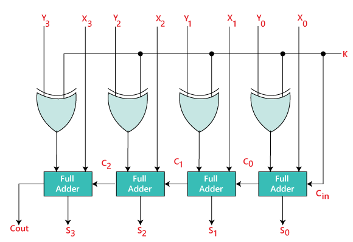
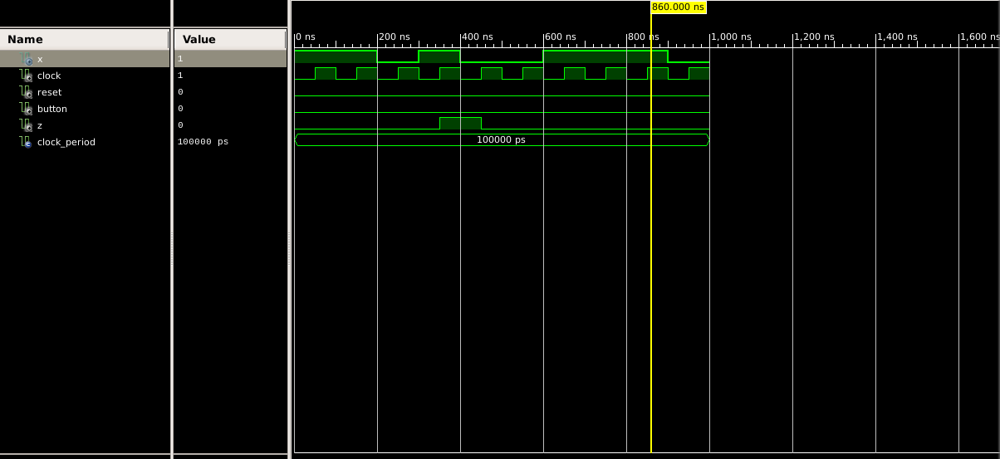
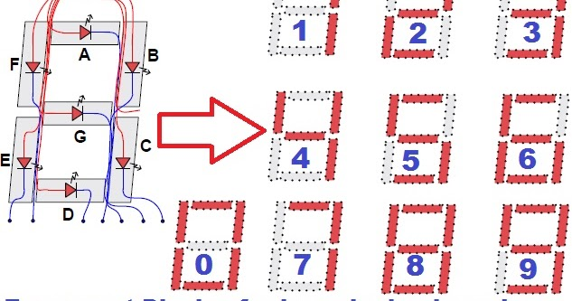

<h1 align = "center">Adder-Subtractor</h1>
<h2>Overview</h2>

An efficient digital circuit that performs both addition and subtraction operations on binary numbers. It utilizes 2's complement representation for subtraction, allowing a unified approach for arithmetic operations. The circuit takes two inputs, A and B, and produces a sum output with a carry-out signal indicating overflow conditions.

<h2 align = "center">  <b>Block Diagram Adder-Subtractor:</b></h2>
 

  

   

<h1 align = "center">Sequence Recognizer Circuit</h1>
<h2>Overview</h2>

A specialized digital circuit designed to detect the binary sequence "1101" within an input stream. Implemented as a finite state machine (FSM), it transitions between states based on incoming bits, ultimately triggering a recognition signal when the specified pattern is identified.

<h2 align = "center">  <b>Waveform Sequence Recognizer:</b></h2>
 

  

   

<h1 align = "center">Seven Segment Display</h1>
<h2>Overview</h2>

A visual output device representing 4-bit hexadecimal digits (0-15) on a seven-segment display. The display uses a decoder to convert the 4-bit input into signals that control seven segments (a-g), forming the desired hexadecimal digit. For example, "1101" would be displayed as the letter 'D' on the seven-segment display.

<h2 align = "center">  <b>Seven Segment Decoder:</b></h2>
 

  

   

